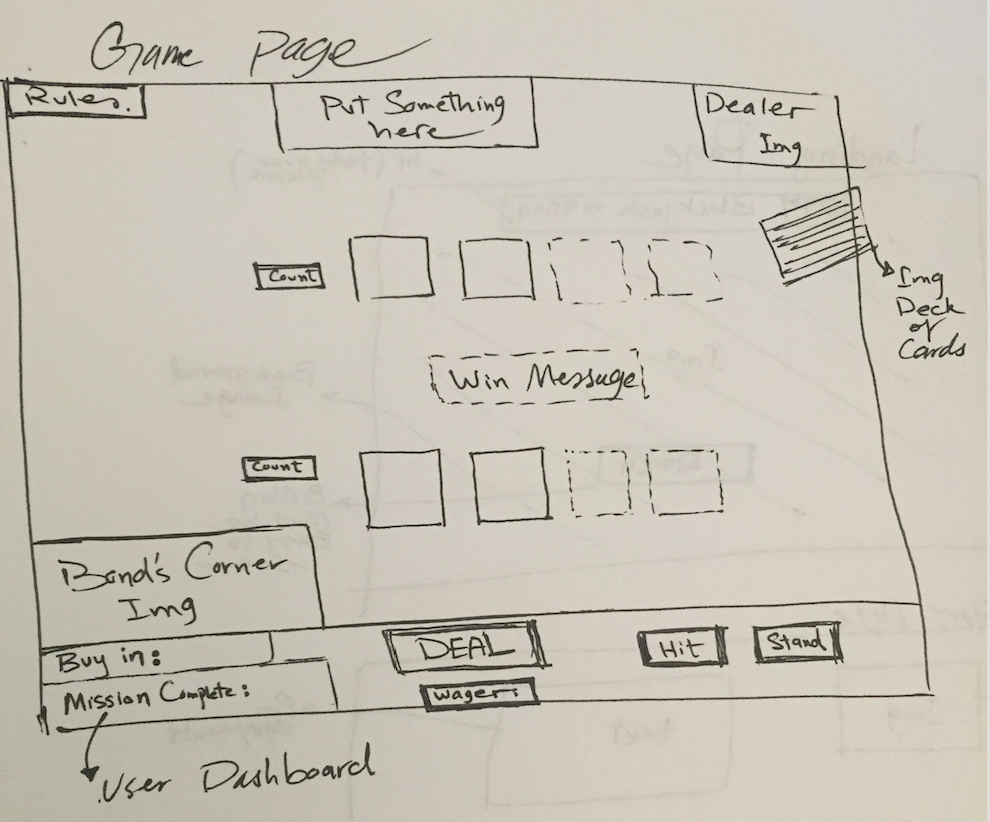
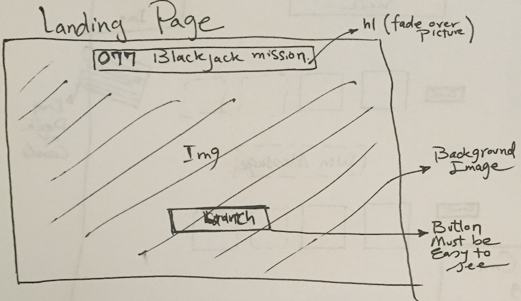
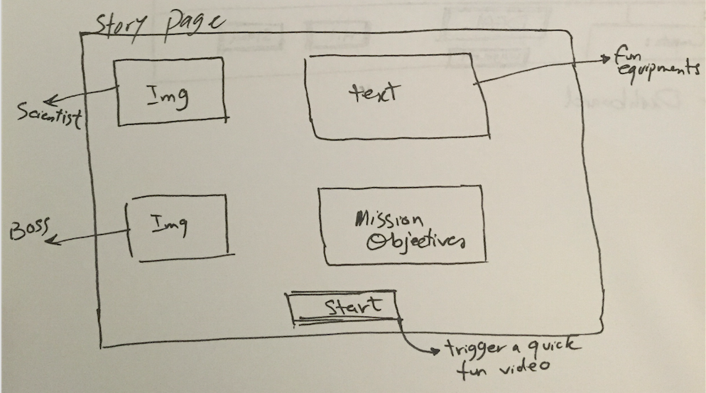

--Game:  Blackjack game
https://raminazizi.github.io/077Blackjack/

--Trello:
https://trello.com/b/1a2QqgEE/007blackjack

--Players: James Bond (user) V.S. computer
--What technologies are you using?
  - HTML
  - CSS
  - Javascript
  - Chrome Dev tools
  - Photoshop
--Set default Rules:
  - Dealer Stands on all 17.
  - Get to $4M to pass mission.

--Installation
  - Download the game folder from my github account @raminazizi

--The approach taken
  - Created a shoe with 5 decks
  - Every time a card is needed, pulled a random card from the shoe.
  - Created player hand array and pushed the selected card into it.
  - Created dealer hand array and pushed the selected card into it.
  - Sum the player hand array and dealer hand array.
  - Compared the two hands and announce who wins the hand.

--Next Step
  - Style the board and the position of the dashboard and cards
  - As the game progress and the player wins/lose a hand, show cool content.
  - create a landing page before the game starts.   
  - Works on writing a better shuffle function.
-------------------Game play Rules-------------
  - Dealer's hand receives its first card face up, and in "hole card" games immediately receives its second card face down (the hole card), which the dealer peeks at but does not reveal unless it makes the dealer's hand a blackjack.
  - Starting with 2 deck of cards.
  - Splice the used cards out after each turn.
  - Pick random cards from the remaining.

-------------------Extras--------------------

--Why Bond needs to win? <!--  Create a story later -->

--Special Effects:
   - After winning/losing the entire game show graphics

--Research Questions:
  - When does a new deck come in? and how to shuffle properly
  - How does the dealer work? Who has the first cards? Dealer's turned card.
  - Does it make sense to create split cards?

--Nice to have options:
  - Allow player to split cards
  - Allow player to change the wager for each hand
  - Bond jokes after winning a couple of hands
  - Bond video when you get close to $2M.

------------------Assets----------------

Wireframes:

